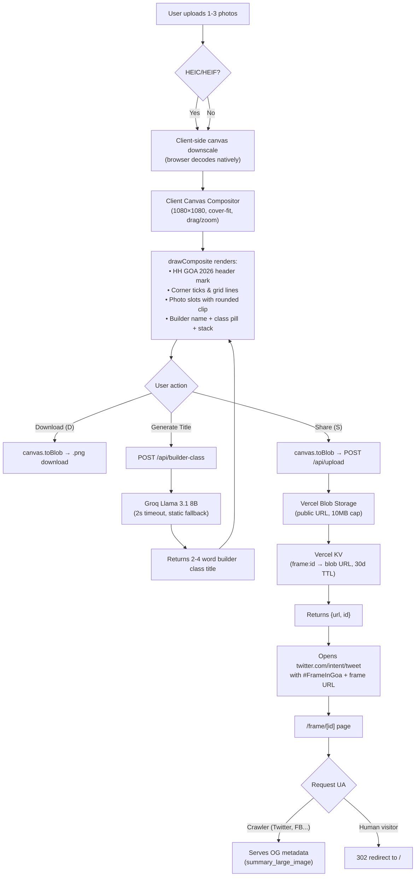

# ShipFrame                  
     
**A branded credential frame generator for HH Goa 2026 — built fast, mobile-first, and unmistakably on-brand.**                                                                                            
                              
---                                                                                                                 
                                                                          
## Problem Statement                 

This project was built for the **Hacker House Goa 2026** hackathon shortlisting task. The brief: build a photo frame / ID badge generator for the event that handles real, uncropped photos from any device (including iPhones shooting HEIC), works on mobile, and produces a credential graphic that is instantly recognizable as _this_ event — not a generic social-media frame.           

The final output is a 1080×1080 PNG credential card with the HH GOA 2026 event mark, builder metadata (name, AI-generated title, tech stack), and geometric design details — all composited client-side on a single HTML5 Canvas, with the same render path for preview, download, and share.

## Live Demo
          
> **[shipframe.vercel.app](https://shipframe.vercel.app)** _(deploy pending Vercel CLI auth)_

## Tech Stack             

| Layer | Technology | Version |
|---|---|---|                                     
| Framework | [Next.js](https://nextjs.org/) (App Router) | 14.2.35 |
| Language | TypeScript | ^5 |                                                         
| UI | React | ^18 |
| Styling | Tailwind CSS + Vanilla CSS design tokens | ^3.4.1 |
| AI Titles | [Groq SDK](https://groq.com/) (Llama 3.1 8B Instant) | ^1.5.0 |
| Image Storage | [@vercel/blob](https://vercel.com/docs/storage/vercel-blob) | ^2.7.0 |
| KV Store | [@vercel/kv](https://vercel.com/docs/storage/vercel-kv) (frame ID → blob URL mapping) | ^3.0.0 |
| Linting | ESLint + eslint-config-next | ^8 / 14.2.35 |
| Perf Auditing | Lighthouse, Puppeteer (dev only) | ^13.4.1 / ^25.5.0 |

## Architecture



## Engineering Challenges

### 1. GitHub Account Migration & Deployment Strategy

The original GitHub account used for development was flagged, requiring migration to a new account. Deployment was intentionally built around the **Vercel CLI** (`vercel --prod`) rather than GitHub App / OAuth integration to avoid dependency on GitHub's account-linking flow and reduce the blast radius of any future account issues.

### 2. Lighthouse TTI Optimization

An initial Lighthouse trace (run via the `lighthouse` and `puppeteer` dev dependencies in `package.json`) showed **2.1s TTI** against a 2.0s target. The bottleneck was traced to hydration bundle size — specifically, large client components being shipped as a single chunk. This was resolved by auditing the server/client component boundary: the `/frame/[id]` share page is a pure **Server Component** (zero client JS), the `EmptyStateHero` cycling animation was kept client-side but isolated, and the heavy `FrameCanvas` compositor was properly bounded behind `'use client'` with no server-side dependencies leaking in.

### 3. HEIC Handling Without Sharp

Vercel's prebuilt `sharp` binary excludes HEIC/HEVC decode support for licensing reasons. The initial plan to use a serverless `sharp`-based conversion route was abandoned. The current implementation accepts `.heic` / `.heif` files directly in the client `<input>` element (`accept="image/*,.heic,.heif"`) and relies on the browser's native image decoder — modern Safari, Chrome, and Edge all decode HEIC natively. The status text displays `"Converting HEIC…"` during load. This approach eliminated the need for a server-side conversion pipeline entirely.

### 4. Single Rendering Pipeline (No Dual-Render Drift)

An early design had separate rendering paths for the live preview canvas and the exported download/share PNG, which risked visual drift between what the user sees and what gets shared. This was solved by making the **client `<canvas>` the single source of truth**: the same `drawComposite()` function — called with the same `CanvasRenderingContext2D` API — renders both the live preview and the export blob. `getCompositeBlob()` creates a temporary offscreen canvas, calls `drawComposite()` identically, and returns the result via `canvas.toBlob()`. Preview and export are pixel-identical by construction.

### 5. Design System from Real Product Analysis

The initial UI was a generic dark-neon layout (cyan accents on navy). This was replaced with a real design system synthesized from analyzing **Linear** (for discipline on light/dark mode, type scale, and restrained motion) and **Warp** (for their approach to glow and gradient — layered, low-saturation, purposeful). The resulting system uses a single accent hue (`#D4A574`, a warm sandstone), Space Grotesk + JetBrains Mono typography pairing, and CSS custom properties for seamless dark/light mode switching — documented in full in `DESIGN.md`.

## Local Setup

```bash
# Clone
git clone https://github.com/sudhanshuyembadwar8new-ctrl/shipframe.git
cd shipframe

# Install dependencies
npm install

# Set up environment variables (copy and fill in your keys)
cp .env.example .env.local
# Required:
#   GROQ_API_KEY         — for AI title generation
#   BLOB_READ_WRITE_TOKEN — for Vercel Blob image storage
#   KV_REST_API_URL      — for Vercel KV
#   KV_REST_API_TOKEN    — for Vercel KV

# Run dev server
npm run dev          # → http://localhost:3000

# Build for production
npm run build

# Start production server
npm start

# Lint
npm run lint
```

## Project Structure

```
├── lib/
│   └── frame-config.ts       # Design tokens, layout slots, copy constants
├── public/
│   └── frame-{solo,duo,trio}.png  # Frame overlay assets
├── src/
│   ├── app/
│   │   ├── page.tsx           # Main app page (client component)
│   │   ├── globals.css        # Full design system (CSS custom properties)
│   │   ├── layout.tsx         # Root layout (fonts, metadata)
│   │   ├── frame/[id]/page.tsx  # OG share page (server component)
│   │   └── api/
│   │       ├── builder-class/route.ts  # Groq AI title generation
│   │       ├── upload/route.ts         # Vercel Blob upload + KV mapping
│   │       └── stats/route.ts          # Frame counter (KV)
│   ├── components/
│   │   ├── FrameCanvas.tsx    # Canvas compositor (single render pipeline)
│   │   ├── ActionBar.tsx      # Download + Share buttons
│   │   ├── EmptyStateHero.tsx # Cycling example frames
│   │   ├── CommandPalette.tsx # Cmd+K palette
│   │   ├── ShortcutsModal.tsx # Keyboard shortcut reference
│   │   ├── ShortcutHint.tsx   # Fixed hint badge
│   │   ├── StatsCounter.tsx   # Live frame counter
│   │   └── ThemeToggle.tsx    # Dark/light mode switch
│   └── hooks/
│       └── useActions.ts      # Keyboard shortcut registry
├── DESIGN.md                  # Full design system specification
├── tailwind.config.ts
├── next.config.mjs
└── tsconfig.json
```

## License

MIT
